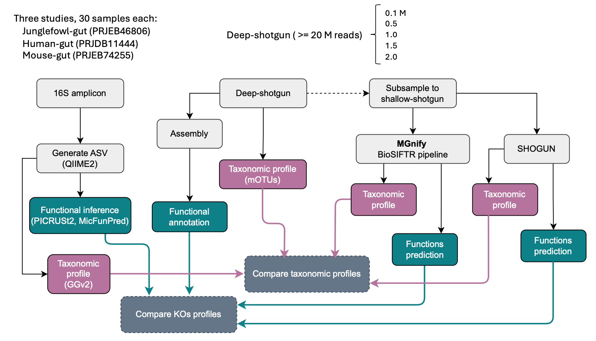

# shallow_shotgun_paper

This repo contains the scripts and tables generated to optimise and validate the [MGnify shallowmapping tool](https://github.com/EBI-Metagenomics/shallowmapping) described in the following publication:

// TODO Add publication reference

Leveraging MGnify Genomic Catalogues for Inferring Metabolic Potential in Shallow-Shotgun Sequenced Samples. Alejandra Escobar-Zepeda, Matti Ruuskanen, Martin Beracochea, Lorna Richardson, Robert D. Finn, Leo Lahti.

<p align="center" width="100%">
   
</p>

## Contents
- [Section 1. The shallowmapping tool optimisation](#sec1)
  1. Synthetic communities design
  2. Taxonomic profile prediction power
  3. Generation of pangenome tables
  4. Functional annotation benchmark
- [Section 2. Pipeline validation on real data](#sec2)
  1. Functional annotation and comparative metagenomics analysis
  2. Taxonomic annotation


<a name="sec1"></a>
## Section 1. The shallowmapping tool optimisation
### 1. Synthetic communities design

To optimise the parameters for [bwamem2](https://github.com/bwa-mem2/bwa-mem2) and [Sourmash](https://github.com/sourmash-bio/sourmash) mapping tools performance in the [MGnify shallowmapping tool](https://github.com/EBI-Metagenomics/shallowmapping), we generated synthetic microbial communities according to the following schema.

<p align="center" width="100%">
   
</p>

[InSilicoSeq](https://github.com/HadrienG/InSilicoSeq) was used to generate each of the synthetic communities from [MetaChic](https://entrepot.recherche.data.gouv.fr/dataset.xhtml?persistentId=doi:10.15454/FHPJH5) chicken-gut genomes catalogue using representative genomes only. The genome contigs were renamed to make it easier to track back the origin of the synthetic reads after mapping

```bash
# Renaming the contigs of all representatives
assembly_rename.py rep_genome.fa rep_genome

# Preparing genomes for tools optimisation (genomes with annotation at species level present in the MGnify catalogue)
cd taxonomy/rich_50
for num in {1..20}; do (cd synth_$num && for genome in $(cat ../known_realpath_genomes.txt | shuf -n50); do (ln -s $genome .); done); done

cd taxonomy/rich_500
for num in {1..20}; do (cd synth_$num && for genome in $(cat ../known_realpath_genomes.txt | shuf -n500); do (ln -s $genome .); done); done

# Preparing genomes for functional benchmarking (all genomes in MetaChick catalogue)
cd function/rich_50
for num in {1..20}; do (cd synth_$num && for genome in $(cat ../all_realpath_genomes.txt | shuf -n50); do (ln -s $genome .); done); done

cd function/rich_500
for num in {1..20}; do (cd synth_$num && for genome in $(cat ../all_realpath_genomes.txt | shuf -n500); do (ln -s $genome .); done); done

# Generating shallow-shotgun raw-reads
for num in {1..20}; do (iss generate --draft synth_$num/*.fa --model novaseq --output raw_reads/synth_$num --cpus 4 --n_reads 2M --compress

```

The ground truth to benchmark functional prediction power was generated using [EggNOG-mapper](https://github.com/eggnogdb/eggnog-mapper) directly from MetaChick MAGs used to build the synthetic communities.

```bash
# Generating functional annotation for each MetaChick MAG
emapper.py -i rep_genome.fa --itype genome --database eggnog/data/eggnog.db --dmnd_db eggnog/data/eggnog_proteins.dmnd --data_dir eggnog/data/ -m diamond --no_file_comments --cpu 16 --dbmem

# Integrating eggnog functions of synthetic communities (emapper evalue threshold = 1E-10)
synth_functions_integrator.py --eggnog metachick_representative_mags/emapper_results --dataset_type low
```

### 2. Taxonomic profile prediction power
We used the MGnify chicken-gut catalogue representative genomes as a reference for mapping. The tools were run with the corresponding parameters and the outputs were processed as described below.

```bash
## bwamem2
# Indexing MGnify representative genomes for bwamem2
bwa-mem2 index -p bwa_reps.fa concat_mgnify_reps.fa

# Generating bwamem2 alignments
for num in {1..20}; do (cd synth_$num && bwa-mem2 mem -M -t 8 bwa_reps.fa synth_$num\_R1.fastq.gz synth_$num\_R2.fastq.gz | samtools view -@ 8 -F256 -F4 -uS - | samtools sort -@ 8 -O bam - -o sort_filt_reps.bam && samtools index sort_filt_reps.bam); done

# QC (ani and cov) filtering and processing bwamem2 alignment types
bam2cov.py --bwa_bam sort_filt_reps.bam --prefix low

# A step to transform genomes relative abundance to species relative abundance. The genomes-all_metadata.tsv file is available at the chicken git catalogue ftp site: https://ftp.ebi.ac.uk/pub/databases/metagenomics/mgnify_genomes/chicken-gut/v1.0.1/genomes-all_metadata.tsv
bwa_genome2species.py --genomes_relab u_relab_1.tsv --metadata genomes-all_metadata.tsv --output low_species_relab.tsv

# Expected vs bwamem2 observed relative abundance
bwa_exp_obs_relab.py --sp_relab low_species_relab.tsv --dataset_type low --synth_prefix synth_$num


## Sourmash
# Indexing the representative species genomes for Sourmash db kmer = 11, 21, 31, 51
sourmash sketch dna -p scaled=1000,k=$kmer --name "$genome" $genome.fna -o $genome.fna.sig
sourmash index chicken_gut_k${kmer}.sbt.zip *sig

# Sketching the raw-reads for Sourmash
sourmash sketch dna -p k=$kmer,abund synth_$num\_R1.fastq.gz synth_$num\_R2.fastq.gz --name synth_$num\_$kmer -o synth_$num\_$kmer.zip

# Running Sourmash gather on representative species dbs
sourmash gather -o low_synth_$num\_gather-k$kmer.csv synth_$num\_$kmer.zip reps_chicken_gut_k$kmer.sbt.zip

# Editing the Sourmash CSV output to add lineage and keep relevant info. The genomes-all_metadata.tsv file is available at the chicken git catalogue ftp site: https://ftp.ebi.ac.uk/pub/databases/metagenomics/mgnify_genomes/chicken-gut/v1.0.1/genomes-all_metadata.tsv 
sm_genome2species.py --sm_csv low_synth_$num\_gather-k$kmer.csv --metadata genomes-all_metadata.tsv --output low_synth_$num\_k$kmer\_species_uw.tsv

# Expected vs Sourmash observed relative abundance
sm_exp_obs_relab.py --sp_relab low_synth_$num\_k51_species_uw.tsv --dataset_type low --synth_data synth_$num


## Processing bwamem2 and Sourmash results
# Calculating expected coverage. Abundance tables are generated by InSilicoSeq
coverage_calc.py --read_1 raw_reads/synth_$num\_R1.fastq.gz --assem_list synth_$num/*.fa --abun_table synth_$num\_abundance.txt

# Calculating performance metrics (F1, precision, recall)
tree_precrecal.py --dataset low --synth_data synth_$num

```

Performance metrics tables generated in this section are available in the [data/optimisation
/taxonomy/](https://github.com/EBI-Metagenomics/shallow_shotgun_paper/tree/main/data/optimisation/taxonomy) directory of this repo. 


### 3. Generation of pangenome tables

The optimisation of taxonomic annotation allows the accurate detection of species clusters in the MGnify genomes catalogue. Functional inference in the shallowmapping pipeline is made through the annotation transference of the pangenome (or core genes). Tables of functions are generated from the tables available in the FTP site of the [MGnify genome catalogues](https://www.ebi.ac.uk/metagenomics/browse/genomes). This can be done by downloading the catalogue and then processing the files locally. The commands below were used in the local copy of the catalogue at the EBI cluster Codon. KEGG modules completeness tables were computed using the [kegg-pathways-completeness-tool](https://github.com/EBI-Metagenomics/kegg-pathways-completeness-tool).

``` bash
# Generate the fasta files of genes lacking functional annotation
pangenomeDB_builder_codon.py \
  --metadata genomes-all_metadata.tsv \
  --mode pre \
  --pfam_dat Pfam-A.hmm.dat.gz
 
# Launching the eggNOG annotation tool
for genome in $(ls *.fasta | sed 's/_accessory.fasta//'); do (emapper.py -i $genome\_accessory.fasta --itype CDS --translate --database eggnog/data/eggnog.db --dmnd_db data/eggnog_proteins.dmnd --data_dir eggnog/data/ -m diamond --no_file_comments --cpu 16 --dbmem -o $genome\_out); done
  
# Once all annotations have completed successfully, move annotation results into emapper results directory and remove the intermediate files.
mkdir emapper_results
mv *_out.emapper.annotations emapper_results
rm *.fasta *.hits *.seed_orthologs
 
# Parsing the annotation files and generating pre-computed profiles at pangenome level
pangenomeDB_builder_codon.py \
  --metadata genomes-all_metadata.tsv \
  --mode post \
  --pfam_dat Pfam-A.hmm.dat.gz
 
# Move the `*.tsv` files to a directory called `functional_profiles_DB`
mkdir functional_profiles_DB && mv *_clstr.tsv functional_profiles_DB
rm -r emapper_results

# Create the KEGG pathways database directory
mkdir kegg_completeness_DB
 
# Generating a KOs list from functional annotation tables for core and pangenome
for genome in $(ls functional_profiles_DB | cut -d'_' -f1); do (echo "processing core: " $genome && cat functional_profiles_DB/$genome\_clstr.tsv | sed '/^#/d' | awk -F '\t' '{if ($9 ~ /true/) print $6 }' | sed '/^-$/d' | tr "," "\n" | sort -u | tr "\n" "," | sed 's/,$/\n/' > kegg_completeness_DB/$genome\_core_kos.txt ); done

for genome in $(ls functional_profiles_DB | cut -d'_' -f1); do (echo "processing pan: " $genome && cat functional_profiles_DB/$genome\_clstr.tsv | sed '/^#/d' | cut -f6 | sed '/^-$/d' | tr "," "\n" | sort -u | tr "\n" "," | sed 's/,$/\n/' > kegg_completeness_DB/$genome\_pan_kos.txt ); done
 
# Running the KEGG pathways completeness tool
cd kegg_completeness_DB
for input in $(ls | cut -d'_' -f1,2 ); do (run_pathways.sh -l $input\_kos.txt -o $input); done
 
# Integrating the outputs
for genome in $(ls *.tsv | cut -d'_' -f1 | sort -u ); do (echo "processing: "$genome && keggcomp_DB.py --core $genome\_core.summary.kegg_pathways.tsv --pan $genome\_pan.summary.kegg_pathways.tsv --output $genome\_clstr); done
rm *.log *.txt *.kegg_pathways.tsv *.kegg_contigs.tsv

```

Pangenome tables are available in the FTP site of the corresponding MGnify genomes catalogue.


### 4. Functional annotation benchmark
The optimisation parameters were set up in the MGnify shallowmapping pipeline and the tool was used to generate the functional profiles to benchmark versus the ground truth. Results using `--core_mode true` and `--core_mode false` were generated.

```bash
# Running the shallowmapping pipeline on the synthetic communities
nextflow run ebi-metagenomics/shallowmapping --input samplesheet.csv --outdir pan_shallow_results --biome chicken-gut-v1-0-1 --run_bwa true 

nextflow run ebi-metagenomics/shallowmapping --input samplesheet.csv --outdir core_shallow_results --biome chicken-gut-v1-0-1 --run_bwa true --core_mode true

# Integrating functional annotation matrices. The following commands were run to integrate Pfam, KOs and KEGG modules annotation.
matrix_integrator.py --input ground_truth/kegg_counts.tsv pan_shallow_results/integrated_annotation/bwa_kos_matrix.tsv core_shallow_results/integrated_annotation/bwa_kos_matrix.tsv pan_shallow_results/integrated_annotation/sm_kos_matrix.tsv core_shallow_results/integrated_annotation/sm_kos_matrix.tsv --output integrated_kos.txt

# Compute performance metrics from functions matrices
matrix2performance.py --input integrated_kos.txt --output metrics_kos.txt

```

The concatenated table of performance generated in this section is available in the [data/optimisation
/function/](https://github.com/EBI-Metagenomics/shallow_shotgun_paper/tree/main/data/optimisation/function) directory of this repo.


<a name="sec2"></a>
## Section 2. Pipeline validation on real data
The shallowmapping pipeline was challenged on real data [PRJEB46806](https://www.ncbi.nlm.nih.gov/sra?linkname=bioproject_sra_all&from_uid=769364) and results were compared versus other strategies for functional prediction:

- 16S rRNA amplicon
   - [Picrust2](https://github.com/picrust/picrust2)
   - [MicFunPred](https://github.com/microDM/MicFunPred)
- Deep shotgun
   - Assembly with [SPAdes](https://github.com/ablab/spades) or [Megahit](https://github.com/voutcn/megahit) and functional annotation with [EggNOG-mapper](https://github.com/eggnogdb/eggnog-mapper)
- Shallow-shotgun (artificially subsampled from deep-shotgun)
   - [SHOGUN](https://github.com/knights-lab/SHOGUN)
   - [shallowmapping pipeline](https://github.com/EBI-Metagenomics/shallowmapping)

<p align="center" width="100%">
   
</p>


### 1. Functional annotation and comparative metagenomics analysis
The raw-reads of 16S rRNA amplicon were processed using QIIME to generate ASVs...

```bash
# Code used to generate ASVs, taxonomic labelling, and functions inference from amplicon data


```

Deep-shotgun raw-reads were filtered by quality, decontaminated, and assembled prior functional annotation.

```bash
# Deep-shotgun raw-reads quality control (fastp)
fastp --in1 sample_1.fq.gz --in2 sample_2.fq.gz --out1 sample_1.filt.fq.gz --out2 sample_2.filt.fq.gz --json sample.fastp.json --html sample.fastp.html --thread 6 --detect_adapter_for_pe

# Deep-shotgun decontamination of human, phyX and chicken (GCF_016699485.2)
bwa-mem2 mem -M -t 16 hg38.fa sample_1.filt.fq.gz sample_2.filt.fq.gz | \
samtools view -@ 16 -f 4 -F 256 -uS - | \
samtools sort -@ 16 -O bam - -o sample_sorted.bam
samtools bam2fq -@ 8 -1 sample_1.hg38.fq.gz -2 sample_2.hg38.fq.gz -0 /dev/null -s /dev/null -n sample_sorted.bam

bwa-mem2 mem -M -t 16 phiX174.fna sample_1.hg38.fq.gz sample_2.hg38.fq.gz | \
samtools view -@ 16 -f 4 -F 256 -uS - | \
samtools sort -@ 16 -O bam - -o sample_sorted.bam
samtools bam2fq -@ 8 -1 sample_1.phix.fq.gz -2 sample_2.phix.fq.gz -0 /dev/null -s /dev/null -n sample_sorted.bam

bwa-mem2 mem -M -t 16 chicken.fna sample_1.phix.fq.gz sample_2.phix.fq.gz | \
samtools view -@ 16 -f 4 -F 256 -uS - | \
samtools sort -@ 16 -O bam - -o sample_sorted.bam
samtools bam2fq -@ 8 -1 sample_1.decont.fq.gz -2 sample_2.decont.fq.gz -0 /dev/null -s /dev/null -n sample_sorted.bam

# HQ and decontaminated reads assembly with SPAdes or MEGAHIT when memory exceeds 200 G
spades.py --only-assembler --meta --threads 16 --memory 120 -1 sample_1.decont.fq.gz -2 sample_2.decont.fq.gz --continue -o sample
megahit -1 sample_1.decont.fq.gz -2 sample_1.decont.fq.gz -t 16 --out-dir sample

# Filtering out contigs length < 500 bp
assembly_filter.py contigs.fasta 500

# EggNOG annotation on contigs of length > 500 bp
emapper.py -i 500_contigs.fasta --itype metagenome --database eggnog/data/eggnog.db --dmnd_db eggnog/data/eggnog_proteins.dmnd --data_dir eggnog/data/ -m diamond --no_file_comments --cpu 16 --dbmem

# Extracting KOs annotation (emapper evalue threshold = 1E-10)
eggnog2KOs.py --eggnog sample.emapper.annotations --sample sample

```

We generated shallow-shotgun datasets from the deep-shotgun HQ decontaminated samples having >10 M raw-reads by random subsampling using the [seqtk](https://github.com/lh3/seqtk) tool. A [SHOGUN docker image](https://quay.io/repository/microbiome-informatics/shogun_knights_lab_1.0.8) developed in this work is available on quay.io.

```bash
# Generating artificial shallow-shotgun data (sequencing yields = 100000, 500000, 1000000, 1500000, 2000000)
SEED=$(shuf -i 0-999 -n 1)
seqtk sample -s $SEED sample_1.decont.fq.gz 100000 > sample_100000_1.fq
seqtk sample -s $SEED sample_2.decont.fq.gz 100000 > sample_100000_2.fq

# Running the shallowmapping pipeline
nextflow run ebi-metagenomics/shallowmapping --input samplesheet.csv --outdir junglefowl_results --biome chicken-gut-v1-0-1 --run_bwa true

# Running SHOGUN. Requires to transform fastq to fasta, fix read names and concatenate the reads
fq2fa.py sample_100000_1.fq.gz sample_100000_R1
cat sample_100000_R1.fasta | sed 's/_/sub/;s/_/|/;s/_//g;s/|/_/' > sample_100000.fasta 
cat sample_100000_R2.fasta | sed 's/_/sub/;s/_/|/;s/_//g;s/|/_/' >> sample_100000.fasta 

shogun pipeline --input sample_100000.fasta --database shogun/databases/ --output sample_100000 --level species --function -t 16

```

Functional tables generated by the different methods were integrated and a comparative metagenomics analysis was performed in R using the [ordination_plots_shallow.ipynb](https://github.com/EBI-Metagenomics/shallow_shotgun_paper/tree/main/notebooks) notebook available in this repository.

```bash
matrix_integrator.py --input picrust2.tsv micfunpred.tsv deep.tsv shallow.tsv shogun.tsv --output mixed_vals_kos.tsv

# Transforming into absence/presence matrix
relab2abspres.py --matrix mixed_vals_kos.tsv --output presabs_kos.tsv
```

KEGG Orthologues annotation tables generated by each of the different methods are available in the [data/validation](https://github.com/EBI-Metagenomics/shallow_shotgun_paper/tree/main/data/validation) directory of this repo.


### 2. Taxonomic annotation

This section corresponds to the post-processing of taxonomic tables generated by the different methods. When necessary, the transformation from NCBI taxonomy to GTDB was made to GTDB r207.

Taxonomic profiles were generated from the deep-shotgun HQ decontaminated reads using the [mOTUs pipeline](https://github.com/EBI-Metagenomics/motus_pipeline) and taxonomy was transformed into GTDB names using the strategy suggested by [Alessio Milanese](https://github.com/motu-tool/mOTUs/wiki/GTDB-taxonomy-for-the-mOTUs).

```bash
# Amplicon data
# Processing ASVs table to add clean taxonomy labels. Removing GG2 (_[0-9]+) monophyletic identifiers in taxonomic ranks and aggregating names
asv2taxo.py --asv_table ASV-table_gg2.tsv --names_table taxonomy.tsv 

# Transform amplicon count tables into relative abundance removing singletons. Discarded singletons and doubletons: 16
counts2relab.py --count_table amplicon_taxo.tsv --output relab_amplicon_taxo.tsv

# Deep-shotgun data. Taxonomic annotation with mOTUs pipeline
nextflow run motus_pipeline/main.nf --mode paired --paired_end_forward sample_1.decont.fq.gz --paired_end_reverse sample_2.decont.fq.gz --sample_name sample 

# Transform mOTUs NCBI labels into GTDB taxonomy
motus2gtdb.py --input sample_merged.fastq.tsv --mapping mOTUs_3.0.0_GTDB_tax.tsv --sample sample

# Transform mOTUs count tables into relative abundance removing singletons. Discarded singletons and doubletons: 127
counts2relab.py --count_table motus_gtdb.tsv --output relab_motus_taxo.tsv

# Shallow-shotgun data. From shallowmapping results
# Aggregating shallow_mapping results at species level
shallow2aggr.py --taxonomy_table sm_taxo_matrix.tsv
shallow2aggr.py --taxonomy_table bwa_taxo_matrix.tsv
matrix_integrator.py --input sm_taxo_matrix.tsv bwa_taxo_matrix.tsv --output shallow_taxo.tsv

# Shallow-shotgun data. From SHOGUN results
# Transforming labels from NCBI to GTDB r207. GTDB metadata files were downloaded from https://data.gtdb.ecogenomic.org/releases/release207/207.0/. Discarded singletons and doubletons: 807
shogun2gtdb.py --shogun_tax shogun_taxo.tsv --metadata_r207 bac120_metadata_r207.tsv.gz ar53_metadata_r207.tsv.gz --output shogun_gtdb.tsv
counts2relab.py --count_table shogun_gtdb.tsv --output relab_shogun_gtdb.tsv


# Integrating all the taxonomic tables. All use GTDB r207 (Greengenes2 2022.10, motus)
matrix_integrator.py --input relab_amplicon_taxo.tsv relab_motus_taxo.tsv shallow_taxo.tsv relab_shogun_gtdb.tsv --output taxonomy_relab.tsv

# Aggregating to different taxonomic ranks
ranks_aggregator.py --input taxonomy_relab.tsv --output taxonomy_relab

# Transforming into presence/absence
relab2abspres.py --matrix taxonomy_relab_domain.tsv --output taxonomy_presabs_domain.tsv

```

Taxonomy plots were generated using the code available in the [ordination_plots_shallow.ipynb](https://github.com/EBI-Metagenomics/shallow_shotgun_paper/tree/main/notebooks) notebook available in this repository.

