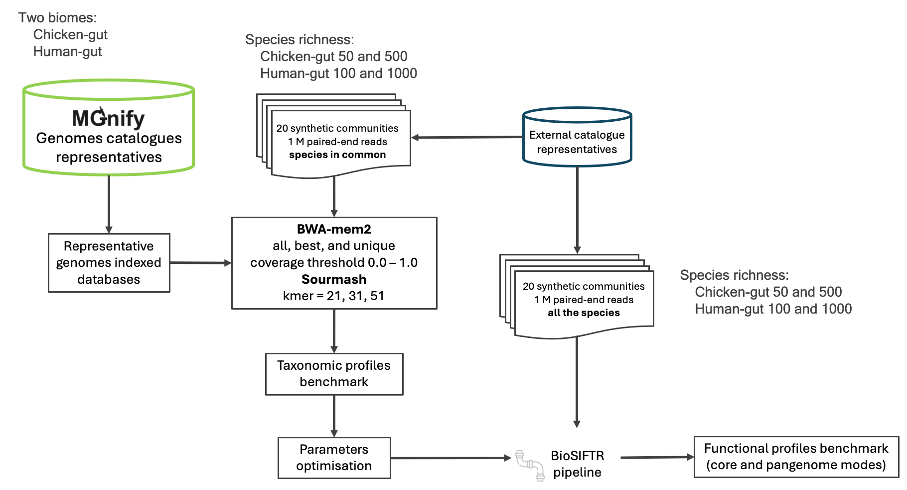

# shallow_shotgun_paper
This repo contains the scripts and tables generated to optimise and validate the [MGnify shallowmapping tool](https://github.com/EBI-Metagenomics/shallowmapping). Described in the following publication:

// TODO Add publication reference
Leveraging MGnify Genomic Catalogues for Inferring Metabolic Potential in Shallow-Shotgun Sequenced Samples. Alejandra Escobar-Zepeda, Matti Ruuskanen, Martin Beracochea, Lorna Richardson, Robert D. Finn, Leo Lahti.

   

## Contents
- [Section 1 . Shallow-mapping tool optimisation](#sec1)
  1. Synthetic communities design
  2. Taxonomic prediction power
  3. Functional annotation benchmark
- [Section 2. Pipeline validation on real data](#sec2)
  1. Comparative metagenomics of KOs presence/absence

## Section 1 . Shallow-mapping tool optimisation
### 1. Synthetic communities design

To optimise the parameters for [bwamem2]() and [Sourmash]() mapping tools performance in the [MGnify Shallow-mapping tool](), we generated synthetic microbial communities according to the following schema.

   

